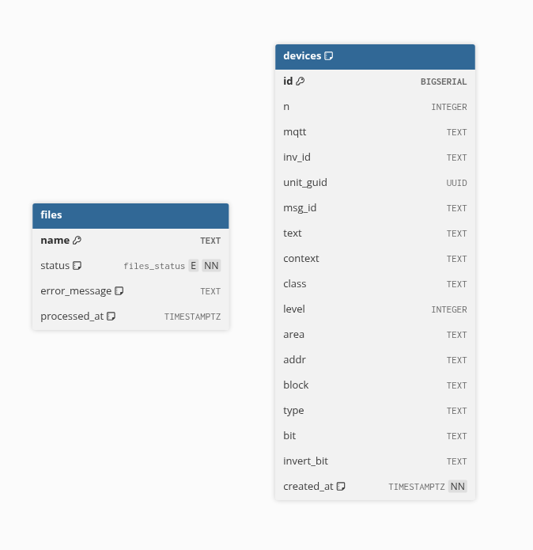
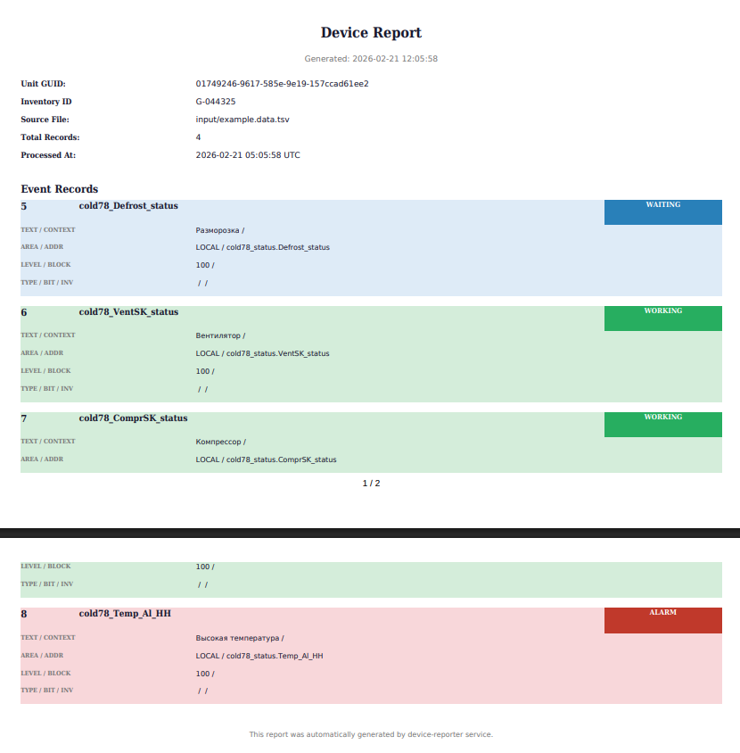

# device-reporter

Сервис на Go для автоматической обработки TSV-файлов с данными устройств. Периодически сканирует директорию, парсит файлы, сохраняет данные в PostgreSQL, генерирует PDF-отчёты по каждому устройству и предоставляет HTTP API для получения данных.

## Содержание

- [Архитектура](#архитектура)
- [Требования](#требования)
- [Быстрый старт](#быстрый-старт)
- [Схема БД](#Схема-БД)
- [API](#api)
- [Конфигурация](#конфигурация)
- [Разработка](#разработка)
- [Тесты](#тесты)

---

## Архитектура

Сервис построен на pipeline-архитектуре из четырёх горутин, связанных каналами:

```
Scanner → Parser → Writer → Reporter
```

- **Scanner** — раз в `scan_interval` проверяет директорию на новые `.tsv` файлы, помечает их в БД как `processing` и отправляет в очередь
- **Parser** — читает файлы из очереди, парсит TSV в структуру `Device`
- **Writer** — сохраняет устройства и статус файла в PostgreSQL одной транзакцией
- **Reporter** — генерирует PDF-отчёт для каждого `unit_guid` из файла

При краше приложения файлы со статусом `processing` автоматически сбрасываются в `pending` при следующем старте.

### Структура проекта

```
.
├── cmd/
│   ├── device_reporter/    # точка входа сервиса
│   └── migrator/           # CLI для миграций БД
│       └── migrations/     # SQL миграции (встроены в бинарник)
├── internal/
│   ├── app/                # сборка зависимостей, запуск горутин
│   ├── config/             # загрузка и валидация конфига
│   ├── controller/http/v1/ # HTTP handlers
│   ├── domain/             # доменные структуры
│   ├── infrastructure/     # генератор PDF отчётов
│   ├── pipeline/           # scanner, parser, writer, reporter
│   └── repository/         # работа с PostgreSQL
├── input/                  # директория для входных TSV файлов
├── output/                 # директория для PDF отчётов
├── local.config.yaml       # конфиг для локальной разработки
├── docker.config.yaml      # конфиг для Docker
├── docker-compose.yaml
├── Dockerfile
└── Taskfile.yml
```

---

## Требования

- Go 1.25+ (или Docker)
- PostgreSQL 18+ (или Docker)
- [Task](https://taskfile.dev) — опционально, для удобного запуска команд

Возможно, подойдут более ранние версии Go и PostgreSQL, но я не тестировал.

---

## Быстрый старт

### Docker (рекомендуется)

```bash
# клонировать репозиторий
git clone <repo> .
cd device-reporter

# поднять всё окружение (БД + миграции + сервис)
docker compose up --build -d

# положить TSV файл в директорию для обработки (там уже лежит один файл)
cp your_data.tsv input/

# проверить что данные появились
curl "http://localhost:8080/api/v1/devices/<unit_guid>?page=1&limit=10"
```

### Локально

```bash
# запустить PostgreSQL
docker compose up postgres -d

# применить миграции
task m_up

# запустить сервис
task start
```

---

### **Схема БД**

Две таблицы: `files` (статус обработки файлов) и `devices` (данные устройств). [Ссылка на ER-диаграмму](https://dbdiagram.io/d/BIOCAD-69955db3bd82f5fce204b68b). 



---

## API

### Получить данные устройства по unit_guid

```
GET /api/v1/devices/{unit_guid}?page=1&limit=10
```

**Параметры:**

| Параметр | Тип | По умолчанию | Описание |
|----------|-----|--------------|----------|
| `page` | int | 1 | Номер страницы |
| `limit` | int | 10 | Записей на странице (макс. 100) |

**Пример запроса:**

```bash
curl "http://localhost:8080/api/v1/devices/01749246-95f6-57db-b7c3-2ae0e8be671f?page=1&limit=1"
```

**Пример ответа:**

```json
{
    "devices": [
        {
            "n": 1,
            "mqtt": "",
            "inv_id": "G-044322",
            "unit_guid": "01749246-95f6-57db-b7c3-2ae0e8be671f",
            "msg_id": "cold7_Defrost_status",
            "text": "Разморозка",
            "context": "",
            "class": "waiting",
            "level": 100,
            "area": "LOCAL",
            "addr": "cold7_status.Defrost_status",
            "block": "",
            "type": "",
            "bit": "",
            "invert_bit": ""
        }
    ],
    "pagination": {
        "page": 1,
        "limit": 1,
        "total": 14,
        "total_pages": 14
    }
}
```

---

## Конфигурация

Приоритет параметров: **флаг командной строки → конфиг-файл -> значение по умолчанию**. Все параметры обязательны (кроме `--config`). Флаги помеченные как обязательные должны быть переданы либо через CLI, либо через конфиг-файл.

ВАЖНО: Я выставил значения по умолчанию для http и postgresql для быстрого запуска. В реальном приложении они должны задаваться пользователем (host, port, username, password, db_name).

| Флаг                   | Алиас | По умолчанию    | Описание                                                |
| ---------------------- | ----- | --------------- | ------------------------------------------------------- |
| `--config`             | `-c`  | —               | Путь до конфиг-файла (YAML)                             |
| `--watch-dir`          | `-w`  | input           | Директория для отслеживания новых TSV файлов            |
| `--reports-dir`        | `-r`  | output          | Директория для сохранения PDF отчётов                   |
| `--scan-interval`      | `-s`  | 3s              | Интервал сканирования директории (например `30s`, `1m`) |
| `--pg-host`            | —     | localhost       | Хост PostgreSQL                                         |
| `--pg-port`            | —     | 5432            | Порт PostgreSQL                                         |
| `--pg-username`        | —     | postgres        | Имя пользователя PostgreSQL                             |
| `--pg-password`        | —     | postgres        | Пароль PostgreSQL                                       |
| `--pg-dbname`          | —     | device_reporter | Имя базы данных PostgreSQL                              |
| `--http-host`          | —     | `localhost`     | Хост HTTP сервера                                       |
| `--http-port`          | —     | `8080`          | Порт HTTP сервера                                       |
| `--http-idle-timeout`  | —     | `1m`            | Таймаут простоя HTTP соединения                         |
| `--http-read-timeout`  | —     | `15s`           | Таймаут чтения HTTP запроса                             |
| `--http-write-timeout` | —     | `15s`           | Таймаут записи HTTP ответа                              |

### Конфиг-файл

```yaml
# local.config.yaml
app:
  scan_interval: 30s      # как часто сканировать директорию
  watch_dir: input/       # директория с входными TSV файлами
  reports_dir: output/    # директория для PDF отчётов

postgresql:
  host: localhost
  port: 5432
  username: postgres
  password: postgres
  dbname: device_reporter

http:
  host: localhost
  port: 8080
  idle_timeout: 5m
  read_timeout: 10s
  write_timeout: 10s
```

## Разработка

### Доступные команды (Taskfile)

```bash
task start        # запустить сервис локально с конфиг-файлом
task build        # собрать бинарник в ./bin/
task tests        # запустить тесты
task m_up         # применить миграции
task m_down       # откатить миграции
task docker-up    # поднять docker compose
task docker-down  # остановить docker compose
```

### Формат входного файла

Сервис принимает `.tsv` файлы со следующими полями (заголовок обязателен):

```
n  mqtt  invid  unit_guid  msg_id  text  context  class  level  area  addr  block  type  bit  invert_bit
```

### PDF отчёты

После обработки файла для каждого уникального `unit_guid` генерируется PDF-отчёт в директории `reports_dir`. Файл называется по `unit_guid`, например, `output/01749246-95f6-57db-b7c3-2ae0e8be671f.pdf`

Отчёт содержит карточки для каждого устройства с цветовой кодировкой по классу (`alarm`, `warning`, `working`).



### Ошибки парсинга

Если файл не соответствует ожидаемому формату, ошибка записывается в таблицу `files` (поле `error_message`, статус `error`). Файл **не будет** обработан повторно.

---

## Тесты

### Unit-тесты

Покрывают каждый компонент пайплайна (`scanner`, `parser`, `writer`, `reporter`) с моками зависимостей через `mockery`.

```bash
task tests
# или
go test -short -v ./...
```

### E2e тесты

Полный прогон системы в Docker — реальная БД, реальные файлы, реальный HTTP. 

Покрывают:
- валидацию CLI флагов (отсутствующие обязательные параметры, невалидный конфиг);
- валидацию флагов мигратора;
- happy path: обработка TSV → запись в БД → генерация PDF;
- идемпотентность: повторный запуск не дублирует данные;
- not happy path: невалидный TSV → статус `error` с сообщением, PDF не создаётся;
- HTTP API: пагинация, невалидные параметры, несуществующий guid;

```bash
./tests/e2e.sh
```

> Для запуска e2e тестов необходим Docker.